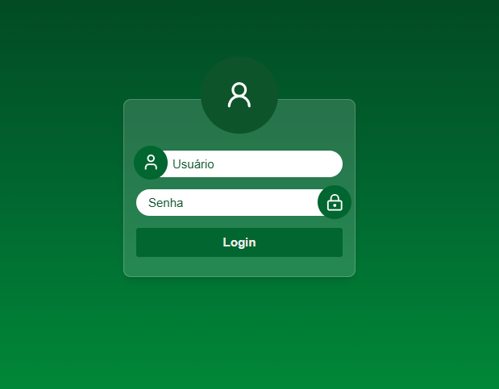
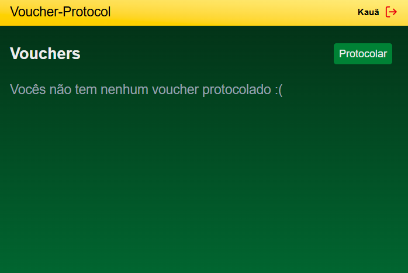
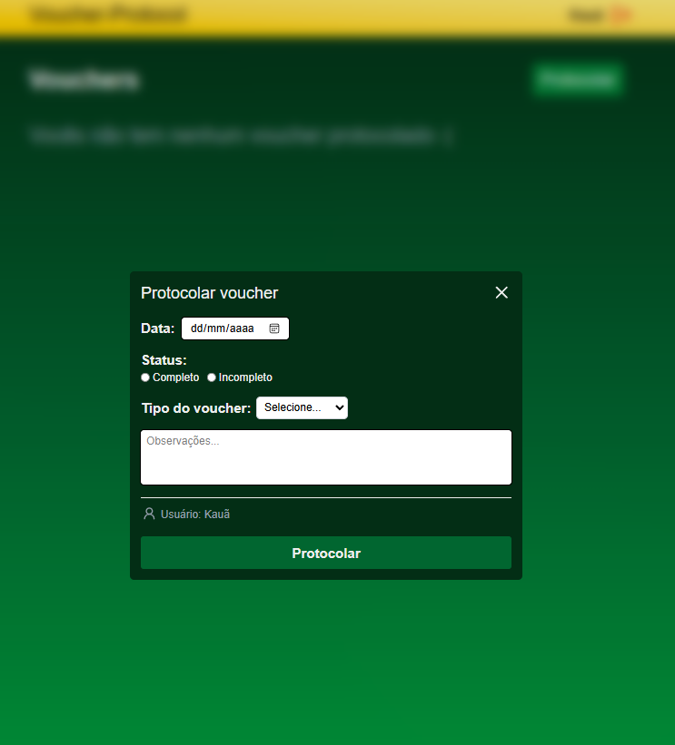
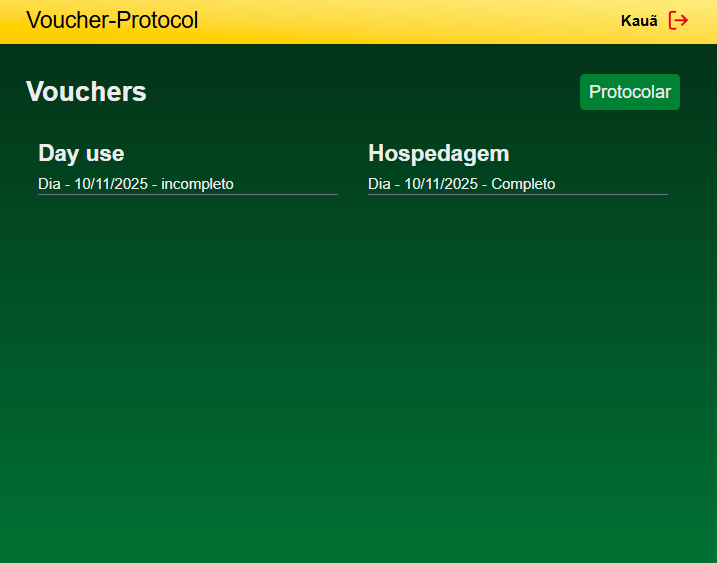

# 🎫 Voucher Management System

A comprehensive system for managing vouchers, user authentication, and account creation. This project provides a user-friendly interface for creating, deleting, and viewing vouchers, along with secure authentication and account management features. It solves the problem of efficiently managing and tracking vouchers within an organization, providing a centralized platform for all voucher-related operations.

## 🚀 Key Features

- **User Authentication:** Secure login and authentication system to protect sensitive data.
- **Voucher Management:** Create, delete, and view vouchers with detailed information.
- **Categorized Vouchers:** Vouchers are categorized into "Day Use" and "Hospedagem" for easy organization.
- **Account Creation:** Admin users can create new user accounts with different roles.
- **Modal-Based Interface:** Utilizes modals for creating new vouchers and displaying voucher information.
- **Client-Side Feedback:** Provides real-time feedback to users through toast notifications.
- **API Integration:** Seamlessly integrates with a backend API for data management and authentication.
- **Server-Side Actions:** Leverages Next.js server actions for secure data manipulation.
- **Cookie-Based Authentication:** Uses cookies to maintain user sessions.

## 🛠️ Tech Stack

- **Frontend:**
  - React
  - Next.js
  - lucide-react (Icons)
  - react-hook-form
  - Zod (Validation)
  - sonner (Toast Notifications)
- **Backend Communication:**
  - Axios
- **State Management:**
  - React Context API
- **Styling:**
  - tailwind-css
- **Utilities:**
  - next/navigation
  - next/headers
- **Build Tools:**
  - Node.js
  - npm or yarn

## 📦 Getting Started

Follow these steps to set up the project locally.

### Prerequisites

- Node.js (version >= 18)
- npm or yarn
- A running backend API (configured via environment variables)

### Installation

1.  Clone the repository:

    ```bash
    git clone https://github.com/Kaua26323/Voucher-Protocol-Frontend
    cd  Voucher-Protocol-Frontend
    ```

2.  Install dependencies:

    ```bash
    npm install # or yarn install
    ```

3.  Configure environment variables:

    Create a `.env.local` file in the root directory and add the following:

    ```
    NEXT_PUBLIC_API=<your_backend_api_url>
    ```

    Replace `<your_backend_api_url>` with the actual URL of your backend API.

### Running Locally

1.  Start the development server:

    ```bash
    npm run dev # or yarn dev
    ```

2.  Open your browser and navigate to `http://localhost:3000`.

## 💻 Usage

1.  **Login:** Enter your username and password on the login page (`/`).
2.  **Dashboard:** After successful login, you will be redirected to the dashboard (`/dashboard`), where you can view and manage vouchers.
3.  **Create Voucher:** Click the "Create Voucher" button to open a modal and enter the voucher details.
4.  **View Voucher Details:** Click on a voucher to view its detailed information in a modal.
5.  **Delete Voucher:** Click the delete button on a voucher to remove it.
6.  **Create Account:** Navigate to `/dashboard/account` to create new user accounts (admin access required).

## 📂 Project Structure

```
voucher-management-system/
├── .next/                     # Next.js build output
├── node_modules/             # Node.js dependencies
├── public/                   # Public assets (images, fonts, etc.)
├── src/                      # Source code
│   ├── app/                  # Next.js app directory
│   │   ├── actions/          # Server actions
│   │   │   ├── auth.ts       # Authentication action
│   │   │   ├── createAccount.ts # Account creation action
│   │   │   ├── deleteVoucher.ts # Delete voucher action
│   │   │   └── registerVoucher.ts # Register voucher action
│   │   ├── dashboard/        # Dashboard pages
│   │   │   ├── account/      # Account creation page
│   │   │   │   └── page.tsx
│   │   │   ├── components/   # Dashboard components
│   │   │   │   ├── dashboardHeader.tsx
│   │   │   │   ├── modalInfo.tsx
│   │   │   │   ├── modalNew.tsx
│   │   │   │   └── vouchersInfo.tsx
│   │   │   ├── layout.tsx    # Dashboard layout
│   │   │   └── page.tsx      # Main dashboard page
│   │   ├── layout.tsx        # Root layout
│   │   └── page.tsx          # Login page
│   ├── components/           # Reusable components
│   │   ├── catchErrors.tsx   # Error handling component
│   │   ├── container.tsx     # Container component
│   │   ├── formButton.tsx    # Form button component
│   │   └── formInput.tsx     # Form input component
│   ├── lib/                  # Utility functions
│   │   └── getCookieServer.ts # Server-side cookie retrieval
│   ├── providers/            # Context providers
│   │   └── voucherContext.tsx # Voucher context provider
│   ├── services/             # API services
│   │   ├── api.ts            # Axios instance
│   │   └── clientFeedback.ts # Client feedback service
│   ├── types/                # TypeScript types
│   │   └── voucher.type.ts   # Voucher type definition
│   ├── middleware.ts         # Middleware for authentication
│   └── next.config.ts        # Next.js configuration
├── .env.local                # Environment variables
├── package-lock.json         # npm lockfile
├── package.json              # Project dependencies and scripts
└── README.md                 # This file
```

## 📸 Screenshots






## 📝 License

This project is licensed under the [MIT License](LICENSE).

## 👏Thanks

Thank you for checking out this project! Your interest and contributions are highly appreciated.
